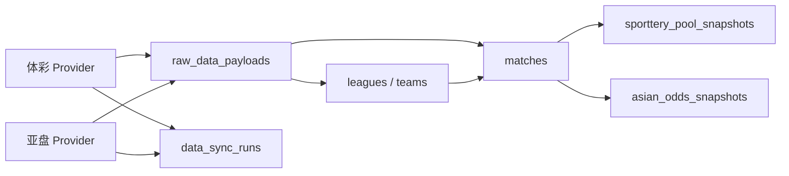
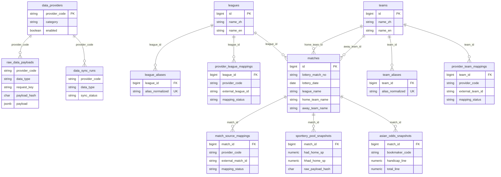
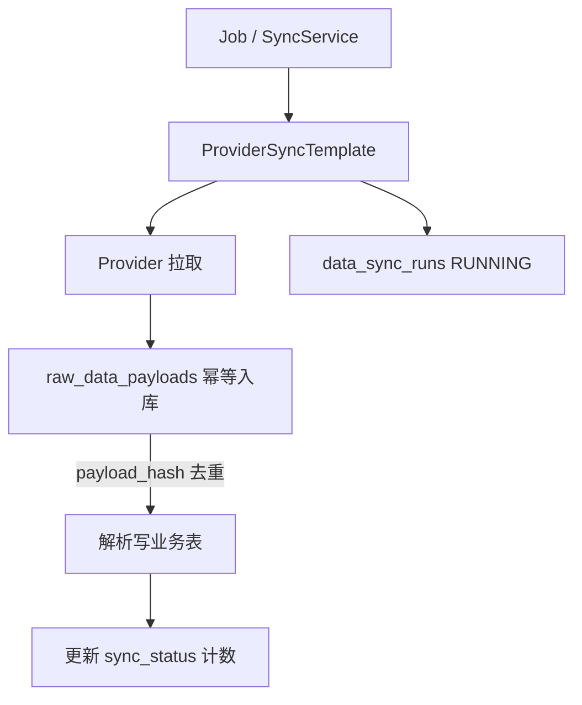
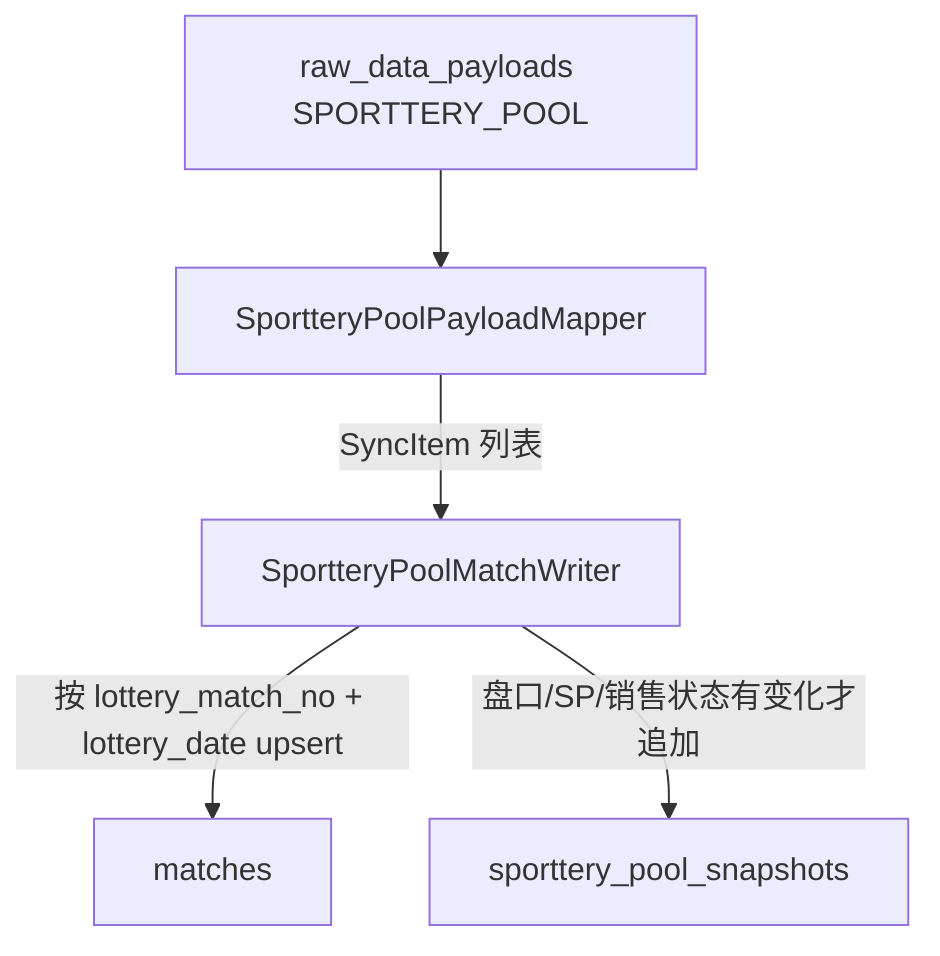
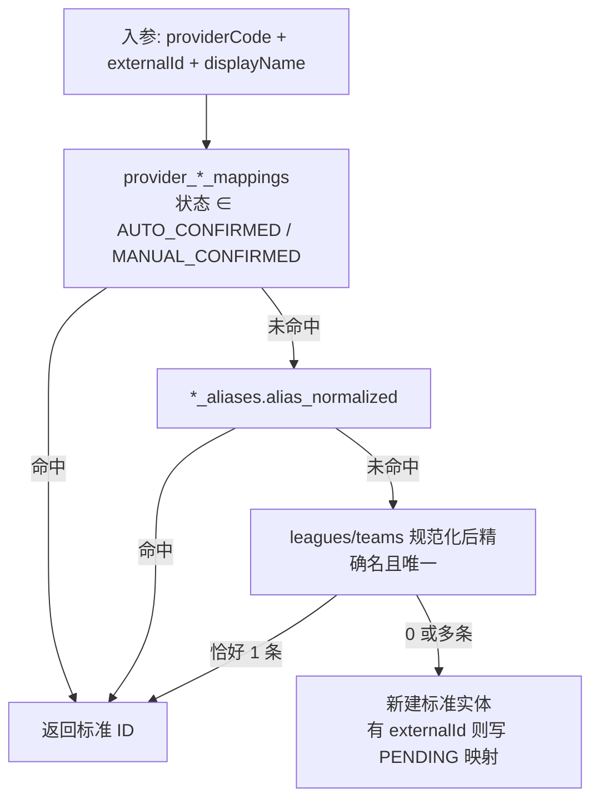
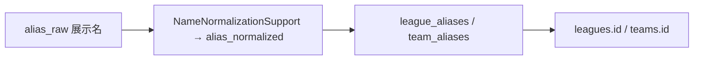
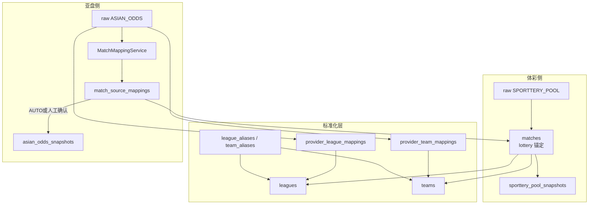

# 业务数据流转与表关系

- 文档版本：v0.1
- 最后更新：2026-07-24
- 作用：用图说明当前已落地表之间的关系，以及体彩 / 亚盘数据如何落到标准实体
- 权威表结构：`backend/src/main/resources/db/migration/V1`～`V4`
- 相关设计：`technical-design.md`；任务进度：`dev-tasks.md`

> 本文回答「数据怎么流、表怎么连」。预测发布、结算等尚未建表的能力只标为后续，不展开。

## 1. 一句话总览

**体彩官方场次**用 `(lottery_match_no, lottery_date)` 锚定内部 `matches`；**亚盘等外部源**不直接改比赛主键，而是通过映射落到同一个 `matches.id`；联赛/球队先标准化到 `leagues` / `teams`，再挂到比赛上。

## 2. 表关系总图（当前库）

### 2.1 角色分工（容易混的三张「映射」）

| 表 | 连什么 | 用来干什么 |
| --- | --- | --- |
| `provider_league_mappings` / `provider_team_mappings` | 供应商 **外部 ID** → `leagues.id` / `teams.id` | 竞彩、亚盘各自联赛/球队 ID 对齐到标准字典 |
| `league_aliases` / `team_aliases` | **人工确认名称别名** → 标准 ID | 「红魔」「Manchester Utd」等名称对齐；**不是**跨源匹配键 |
| `match_source_mappings` | 供应商 **外部比赛 ID** → `matches.id` | 亚盘等外部场次挂到内部同一场比赛（T204 主线） |

标准实体主键（`leagues.id` / `teams.id` / `matches.id`）才是跨源汇合点；别名表只是帮名称落到标准 ID。

## 3. 接入层流转（V1）

每次同步先记运行，再幂等存原始 JSON，再解析写业务表。

要点：

- `data_providers`：注册源（不含密钥）。
- `data_sync_runs`：一轮同步的状态机与额度统计。
- `raw_data_payloads`：`(provider_code, data_type, request_key, payload_hash)` 唯一，保证同内容不重复落库。

## 4. 体彩比赛池同步（已落地 T202）

内部比赛以体彩身份锚定；当前同步会写展示名，联赛/球队标准 ID 可后续由标准化服务回填。

| 步骤 | 写入 | 说明 |
| --- | --- | --- |
| 1 | `matches` | 唯一键 `(lottery_match_no, lottery_date)`；必写 `league_name` / 主客队展示名 |
| 2 | `sporttery_pool_snapshots` | 只追加；与上一快照盘口内容相同则跳过 |
| 3 | （可选后续） | 调用标准化服务填 `league_id` / `home_team_id` / `away_team_id` |

`sporttery_pool_snapshots.raw_payload_hash` 回溯到当次 `raw_data_payloads`，便于对账。

## 5. 联赛 / 球队标准化（已落地 T203）

解析优先级（不做模糊相似度合并）：

人工确认别名：

硬性规则：

- 规范化 key 只用于匹配，不改展示名。
- 「曼联」与「曼城」相似也不自动合并，各自候选。
- `confirmAlias` 只写别名表，不自动改其它 `PENDING` 映射。

## 6. 竞彩 ↔ 亚盘如何对齐

比赛级自动映射服务 **T204 已落地**（`MatchMappingService`）。亚盘同步 Job 与快照写入仍待后续接入；确认后才应写 `asian_odds_snapshots`。

### 6.1 MatchMappingService 规则摘要

1. 已确认 `(provider_code, external_match_id)` → 直接复用。
2. 在开赛时间 ±180 分钟内对 `matches` 打分（主客队 ID/名、联赛、时间）。
3. 主客反转、联赛 ID 冲突、时间差 &gt; 60 分钟 → 不得自动确认，写 `PENDING`。
4. 最高分 ≥ 0.85 且与第二名分差 ≥ 0.10 → `AUTO_CONFIRMED`；否则 `PENDING`。
5. 无候选不插入（`match_id` 非空约束）；`listPending` 查待复核队列。
6. V5 增加 `mapping_explanation` / `mapping_candidates` 保存解释与候选。

读法：

1. 两边联赛/球队先各自解析到**同一个** `leagues.id` / `teams.id`。
2. 再在比赛层生成 `match_source_mappings`；确认后亚盘快照才写到该 `matches.id`。
3. 跨源对账主键是 **`matches.id`**。

## 7. `matches` 字段怎么理解

| 字段 | 含义 |
| --- | --- |
| `id` | 内部比赛主键；快照与来源映射都挂这里 |
| `lottery_match_no` + `lottery_date` | 体彩官方身份，产品侧「一场竞彩」的自然键 |
| `league_name` / `home_team_name` / `away_team_name` | 同步时的展示名（标准化前也可有值） |
| `league_id` / `home_team_id` / `away_team_id` | 标准字典外键；可空，标准化后回填 |
| `match_status` | 内部状态机（`SCHEDULED` / `LOCKED` / …） |
| `home_score` / `away_score` | 赛果同步后写入（后续任务） |

## 8. 映射状态共用语义

`provider_*_mappings` 与 `match_source_mappings` 共用：

| status | 含义 |
| --- | --- |
| `PENDING` | 候选，待复核 |
| `AUTO_CONFIRMED` | 自动确认，可参与正式解析 |
| `MANUAL_CONFIRMED` | 人工确认 |
| `REJECTED` | 拒绝，不再自动命中 |

标准化解析**只认** `AUTO_CONFIRMED` / `MANUAL_CONFIRMED` 的外部 ID 映射。

## 9. 与代码的对应关系（便于跳转）

| 流转 | 主要类 |
| --- | --- |
| 同步模板 | `data.service.ProviderSyncTemplate` |
| 体彩池同步 | `SportteryPoolSyncServiceImpl` → `SportteryPoolPayloadMapper` → `SportteryPoolMatchWriter` |
| 联赛/球队标准化 | `LeagueNormalizationService` / `TeamNormalizationService` |
| 名称规范化 | `NameNormalizationSupport` |
| 比赛级映射 | `MatchMappingService` / `MatchMappingScoreSupport` |

## 10. 尚未建表 / 未串通的部分

- 预测、快照、结算相关表：见 `technical-design.md` M3/M4，本文不画。
- 体彩同步写库后**尚未强制**调用标准化回填 `league_id` 等（服务已就绪，接入在后续任务）。
- 亚盘同步 Job 接入 `MatchMappingService` 与仅对已确认映射写 `asian_odds_snapshots`：后续任务（T206）。
- 映射人工确认/拒绝 HTTP API：T205 已落地（`/api/admin/provider/mappings/*`）；生产鉴权仍待 T601，当前 Security 对 admin 路径 denyAll。

## 11. 变更记录

| 日期 | 说明 |
| --- | --- |
| 2026-07-24 | 初版：基于 V1～V4 与 T202/T203 落地情况整理表关系与主链路图 |
| 2026-07-24 | 补充 T204：MatchMappingService 打分/待复核与 V5 解释候选列 |
